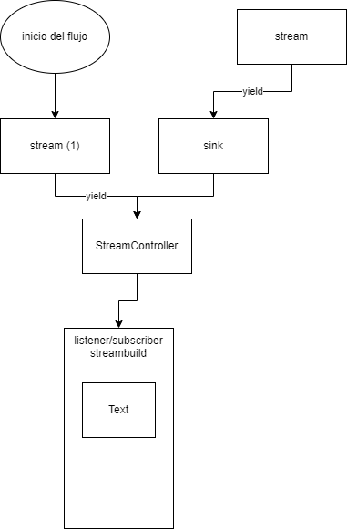

# untitled12

* StreamController: El streamcontroller se vincula al Streambuilder. Asi que cada actualizacion del streamcontroller va al streambuilder.
* El StreamController se actualiza de dos maneras:
  * Con la funcion Stream hace yield. Esta solo se carga cuando se carga la página
  * Cuando se llama al metodo sink del StreamController.
  * Sink puede llamarse con un valor fijo, o con un valor que sea devuelto por una funcion Stream.
